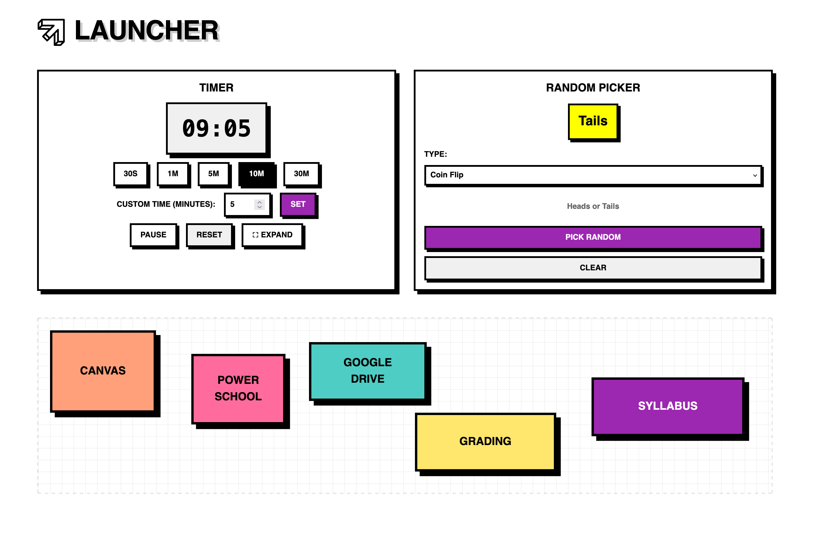

# Launcher 

A main launcher page intended for teachers. It allows you to add custom links to websites or local files. It includes a timer and a random picker also.



## Development

Install dependencies:
```bash
npm install
```

Run the development server:
```bash
npm run dev
```

Build for production:
```bash
npm run build
```

Preview production build:
```bash
npm run preview
```

## Tech Stack

- Vue 3
- Vite
